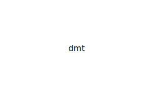

# SVG Logo Maker

This Node.js command-line application generates simple logos in SVG format based on user input for text, text color, and shape. It supports three shapes: Circle, Triangle, and Square.

## Features

- Allows users to input text (up to three characters).
- Provides options to choose a shape and set colors for text and shape.
- Generates SVG logos based on user choices.
- Saves the generated SVG file in the `examples/` folder.

## Installation

1. Clone this repository.

2. Install dependencies using `npm install`.

## Usage

1. Run the application using the command: node index.js

2. Follow the prompts to:
- Enter text for the logo (three characters maximum).
- Choose a shape: Circle, Triangle, or Square.
- Specify text color and shape color (color keyword or hexadecimal number).

3. Upon completion, the generated SVG file will be saved in the `examples/` folder.

## Example

Here's an example of the generated logo:

## Test

Run tests using Jest: npm test

## Author

Matthew Thurber

## Screen Recording

https://drive.google.com/file/d/185g4B576Fuj9XI-9IofU0lZvEhAdmmv_/view